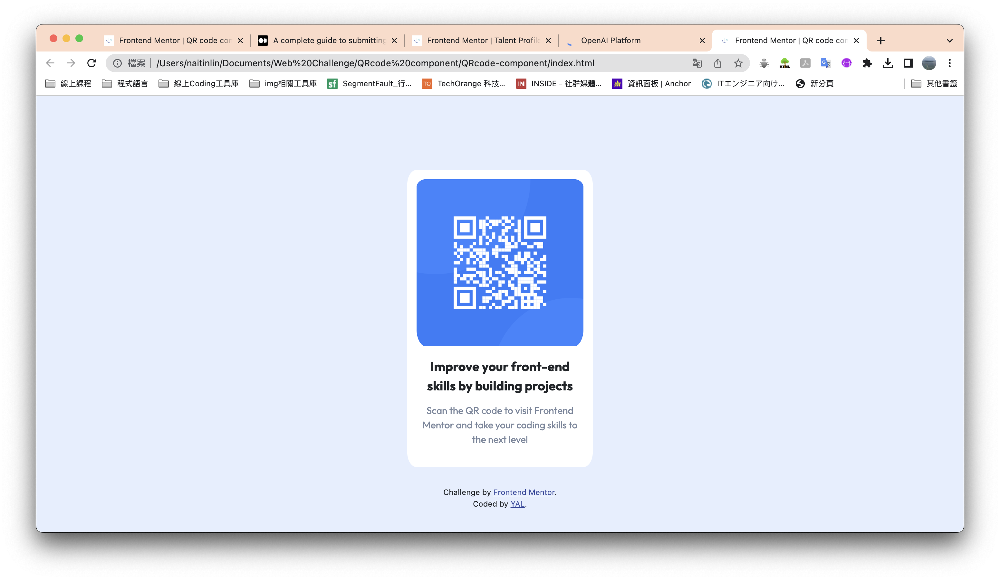

# Frontend Mentor - QR code component solution
This is a solution to the [QR code component challenge on Frontend Mentor](https://www.frontendmentor.io/challenges/qr-code-component-iux_sIO_H). Frontend Mentor challenges help you improve your coding skills by building realistic projects. 

## Table of contents
- [Overview](#overview)
  - [Screenshot](#screenshot)
  - [Links](#links)
- [My process](#my-process)
  - [Built with](#built-with)
  - [What I learned](#what-i-learned)
  - [Continued development](#continued-development)
- [Author](#author)
- [Acknowledgments](#acknowledgments)

## Overview
已經很久沒使用HTML跟CSS，開始到完成至少花了4小時，如果沒用bootstrap框架，整個挑戰時間應該還會增加2小時左右。

### Screenshot


### Links
- Live Site URL: [https://yacodingroom.github.io/QRcode-component/]

## My process
### Built with
- Semantic HTML5 markup
- CSS custom properties
- Bootstrap

### What I learned
重新理解了padding、margin的差異，還有響應式頁面。

```css
.mx-auto {
    margin-left: auto;
    margin-right: auto;
    /* align center */
}

@media (max-width: 375px) {
    .card {
        margin-top: 20% !important;
    }
}
```

### Continued development
響應式頁面

## Author
- Website - YAL
- Frontend Mentor - [@YAcodingroom]
(https://www.frontendmentor.io/profile/YAcodingroom)

## Acknowledgments
感謝Angela老師，感謝靜文老師，感謝Google，感謝Bootstrap，感謝宇宙。
